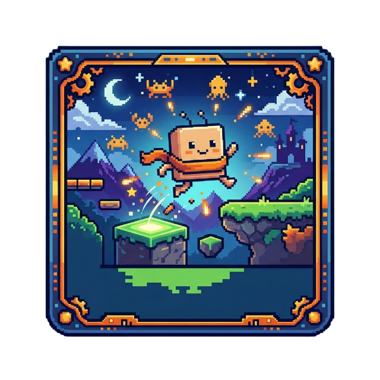

<div align="center">
  
  
  # Dodge Box 📦

  *A fast-paced, multiplayer 2D platformer full of chaos, survival, and randomly applied modifiers!*
  
  [](https://www.python.org/)
  [](https://www.pygame.org/)
  [](https://zeromq.org/)
</div>

---

## 🎮 About The Game
**Dodge Box** is a multiplayer 2D platform survival game built in Python using Pygame and ZeroMQ. You play alongside (or against) your friends to survive deadly traps, navigate treacherous platforms, and outlast the level timer!

Once the countdown hits zero, a magical door will spawn somewhere in the level. Reach the door before your friends do to escape and advance to the next stage! 

But beware: as you progress deeper, the game throws **random physics modifiers** at you to keep everyone on their toes!

## ✨ Features
* **Multiplayer Chaos:** Connect to the server with your friends and see who survives the longest.
* **Progressive Levels:** Battle your way through uniquely themed worlds:
  * 🌌 Galaxy Map
  * 🧊 Icy Spikes
  * 🏖️ Beach Map
  * ...and more!
* **Random Modifiers:** Expect the unexpected. Physics and gameplay change dynamically between runs:
  * 🪶 *Low Gravity*
  * 🏃 *Fast Movement*
  * ⛸️ *Ice Skates*
  * 🙃 *Inverted Controls*
  * 🦘 *Double Jump*
  * ☄️ *Meteor Shower*
  * 🎯 *Sniper Fire*
* **Customization:** Choose your own character colors in the main menu to stand out from the crowd!
* **Spectator Mode:** If you fall off or die, you turn into a ghost and can float around to watch the remainder of the level.

---

## 🛠️ Installation

Make sure you have [Python 3](https://www.python.org/downloads/) installed. Then, clone the repository and install the dependencies.

```bash
# Clone the repository
git clone git@github.com:lcrzhang/Dodge_Box.git
cd Dodge_Box

# Create a virtual environment (optional but recommended)
python -m venv venv
source venv/bin/activate  # On Windows use: venv\Scripts\activate

# Install the required libraries
pip install pygame pyzmq pillow
```

---

## 🚀 How To Play

The game operates on a Client-Server architecture. You will need one person to host the server, and everyone else runs a client to connect to it.

### 1. Start the Server
The host must start the server script first. By default, it runs on `localhost` port `2345`.
```bash
python mygame_server.py
```
*(If playing over the internet, you can use tools like `ngrok tcp 2345` to expose your server port to your friends).*

### 2. Connect the Client
Once the server is running, players can start their clients. Pass your desired username directly into the command line!
```bash
python mygame_client.py [YourName]
```
Example: `python mygame_client.py Leo`

---

## ⌨️ Controls

| Action | Key / Button |
| :--- | :--- |
| **Move Left** | `A` or `Left Arrow` |
| **Move Right** | `D` or `Right Arrow` |
| **Jump** | `W`, `Up Arrow`, or `Spacebar` (Hold for higher jump) |
| **Drop Down** | `S` or `Down Arrow` (Fall through wooden platforms) |
| **Pause Menu** | `ESC` |
| **Volume Control** | `+ / -` (Increase/Decrease Music Volume globally) |

---

## 👥 Credits
**Game made by:**
* Patrick van de Meent
* Leo Chao Ran Zhang
* Luuk van der Duim
* Jelle Zegers

---
<div align="center">
  <i>Can you survive the Dodge Box?</i>
</div>
